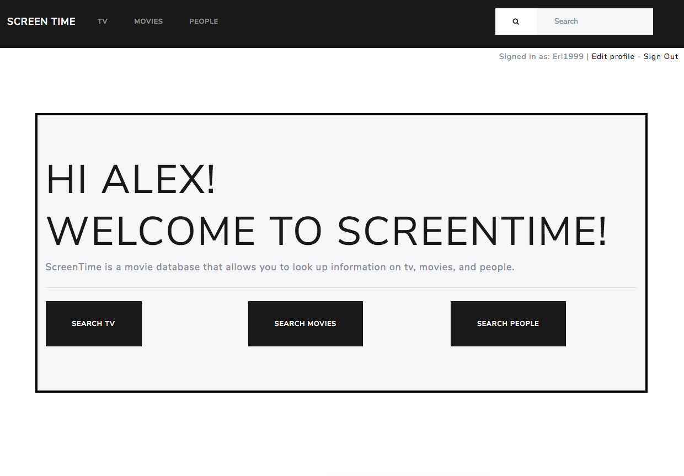

# Screen-Time

Heroku: https://afternoon-plateau-64144.herokuapp.com/

Versions:
Ruby: 2.5.0,
Rails: 5.2.0,
React on Rails: 1.7.1.

Built with Rails, React, and Bootstrap, and Bootswatch.

Features:
Using the TMDB api, ScreenTime connects with information about their favorite movies, tv shows, and people.
It provides a popular movie, tc shows, and people section, as well as an auto complete search tool that allows people to search directly for who they are looking for.

Reasoning for choices:
I decided to use Rails for the backend because I found a good wrapper gem, 'themoviedb-api', that allowed me to communicate with the TMDB database very quickly and efficiently.
Additionally, I wanted for other functionality such as users with the Devise Gem. I decided to use React to make the website more interactive with the nav bar and the auto complete search feature.
I really liked how you can separate everything into small components making everything more manageable. After including Bootstrap, Bootswatch for the CSS and design, I think everything came together into a clean web app.

Future features:
Comments, favorites, own rating system, genres.
